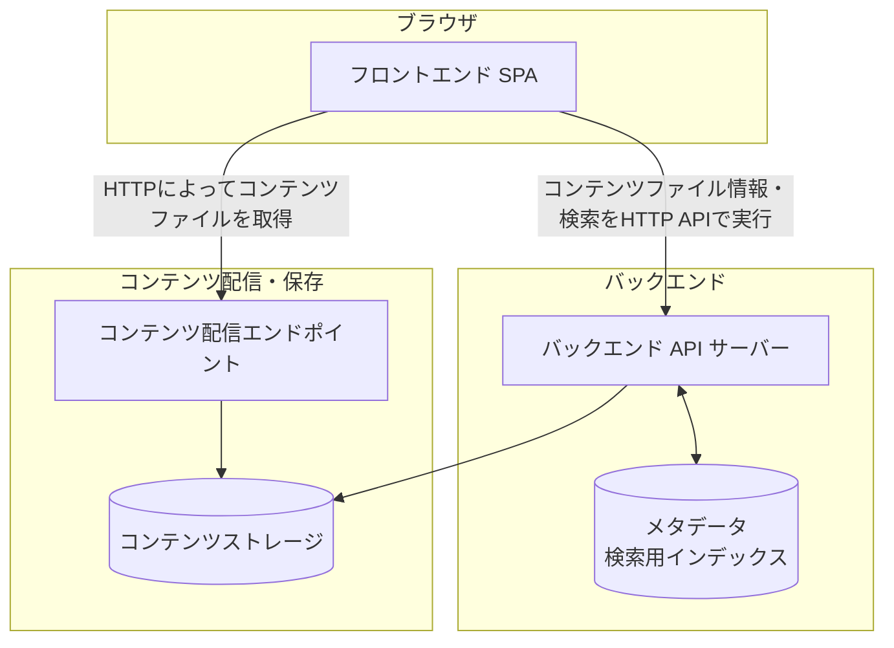

# ドキュメントのスコープ
本ドキュメントは、以下をスコープとする。

* システム全体のアーキテクチャ設計
* それぞれの成果物の責務

# アーキテクチャ設計の方針
このシステムのアーキテクチャは以下の方針で設計する。

* 特定のインフラ専用とならないような設計を行う
  * あくまでも専用としないことが重要であり、オプションとして特定のインフラに依存した設計を行うことは否定しない
* コンテンツファイルやユーザーが大規模になってもスケールするような設計を行う
* コンテンツファイルやメタデータファイルのポータビリティを第一に考える

# 設計
## システム構成

本システムは大まかには以下のような構成要素からなる。

この中で本リポジトリにおける成果物は、フロントエンドSPA・バックエンドAPIサーバーアプリケーションのみとする。

つまり、コンテンツストレージの具体実装、HTTPサーバー、メタデータDBの具体的なインフラについては取り扱わない。
この設計によって、メタデータDBとしてインメモリ・RDB・NoSQLなど、コンテンツストレージとしてファイルシステム・オブジェクトストレージ・RDBなど、コンテンツ配信にCDNを活用するかどうかなど、インフラの選択肢を広く持つことができる。

## 各構成要素の責務
### フロントエンドSPA
バックエンドAPIサーバーからコンテンツファイル情報や検索結果を取得し、コンテンツ配信エンドポイントから正規コンテンツを取得して表示する。

### バックエンドAPIサーバー
コンテンツファイル情報及び検索機能をHTTP APIとして提供する。

### メタデータ及び検索用インデックス
正規コンテンツとXMPサイドカーから導出した、検索やキャッシュに利用する情報を保持する。
ここに保持する情報は派生情報とし、コンテンツファイル及びXMPサイドカーファイルから再構築できなければならない。

### コンテンツストレージ
コンテンツファイル及びXMPサイドカーファイルを、それぞれの具体実装に応じた保存表現で保持する。
ただし、具体的な保存表現の違いを隠蔽し、保存時と同一のバイト列としてポータブルに取得できるようにする。
具体的な保存基盤は本リポジトリのスコープとしない。

### コンテンツ配信エンドポイント
コンテンツファイルをHTTPによってフロントエンドSPAへ配信する。
HTTPサーバー、オブジェクトストレージ、CDNなどの具体的な構成は本リポジトリのスコープとしない。
