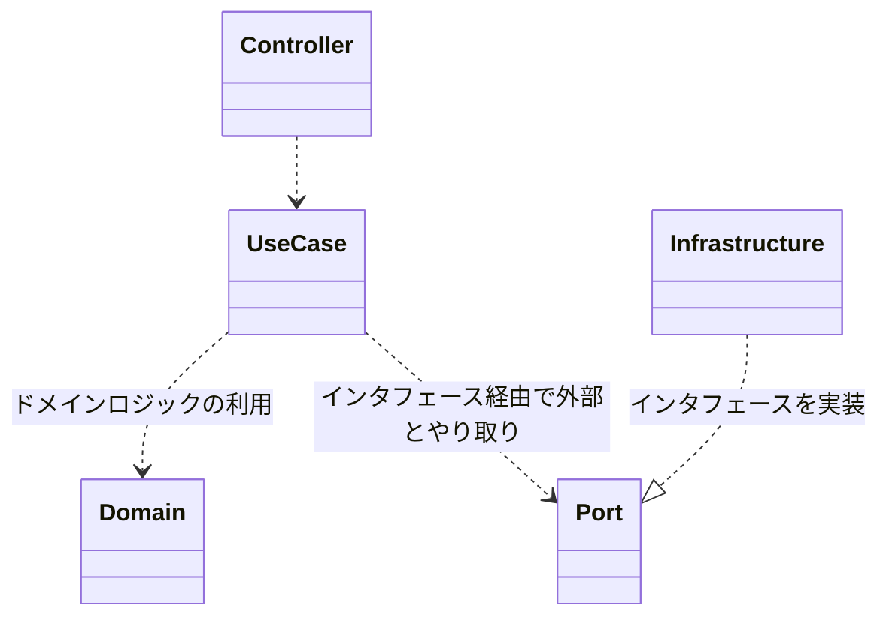
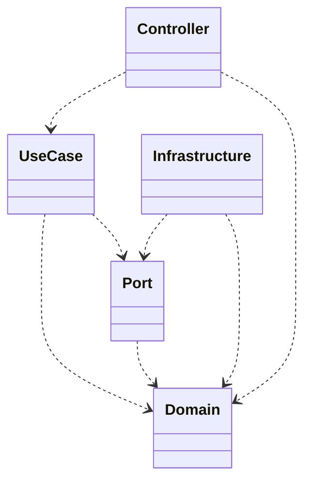

# ドキュメントのスコープ
本ドキュメントは以下をスコープとする。

- ソフトウェアアーキテクチャの設計方針
- ハイレベルなコンポーネント層の構成と責務

反対に、個々のコンポーネントの具体的な責務といった設計はスコープ外とする。
また、Observabilityやサーバーフレームワークといった直接アプリケーション処理を構成しないコンポーネントについては対象外とする。

# ソフトウェアアーキテクチャの設計方針
バックエンドAPIサーバーのソフトウェアアーキテクチャは、可読性・保守性・拡張性・テスト容易性を重視するためにクリーンアーキテクチャを採用する。

ただし、クリーンアーキテクチャの原則を厳密に守るのではなく、クリーンアーキテクチャにおいて重要視している考え方を取り入れつつ、過度に複雑さを増やさない目的で必要に応じて柔軟に設計する。

# クリーンアーキテクチャに基づくハイレベルでのコンポーネント層の構成と責務
## 構成の概要
バックエンドAPIサーバーにおいては、アプリケーションの処理を構成するコンポーネントはハイレベルでは以下のいずれかの責務を持つ。

- Domain
- Controller
- UseCase
- Port
- Infrastructure

なお、これらは具体的なクラスやソースコードとして存在するものではなく、あくまでもハイレベルでの責務に基づく分類としての層である。
そのため、ここで述べた各層は適切な分割を行った上で複数の具体的なクラスやサブモジュールとして実装することを推奨する。
ただし、具体的なクラスやモジュールはこの中の複数の層の責務を持つことを許容しない。

以下に、アプリケーション処理に関する各層の関係を図示する。

また、以下にソースコードレベルにおける依存関係についての各層の関係を図示する。
この図に記載のない依存関係は禁止する。

## 各層の責務
### Domain
Domain層は、アプリケーションのデータモデルやそのデータモデルがドメイン上満たすべき要件を表現する責務を持つ。

反対に、この層はアプリケーションのデータモデルが実際のインフラにおいてどのように表現されるかという実装の詳細に関する責務を持ってはいけない。
この責務はInfrastructure層が持つべきものであるためである。

### Port
Port層は、Infrastructure層が提供する外部とのやり取りのインターフェースを定義し、利用側から実際の物理的な操作を抽象化する責務を持つ。
つまり、この層は依存性逆転の原則に基づくためのインタフェースを提供する責務を持つ。

反対に、この層は具体的な外部とのやり取りの実装の詳細を持ってはならない。
この責務はInfrastructure層が持つべきものである。

また、この層が公開するインタフェースには、Infrastructure層において定義される物理的なデータ表現を含めてはならない。
Port層の利用者はInfrastructure層に依存せずに利用することができるべきだからである。

### Infrastructure
Infrastructure層は、DBや外部APIなど本アプリケーションが依存する外部との通信を実際に行う責務を持つ。
また、必要に応じて、Domain層において定義された論理データモデルをインフラという物理的実体においてどのように表現するかという物理データモデルを定義する責務を持つこともある。

反対に、この層はアプリケーションのビジネスドメイン上の要件を表現する責務を持ってはいけない。
この責務はUseCase層やDomain層が行うべきものであるためである。

また、この層は、独自の利用インタフェースを持つべきではなく、あくまでもPortが定義するインタフェースの具体実装としての責務のみを持つべきである。

### UseCase
UseCase層は、アプリケーションのビジネスドメイン上の具体的な処理の流れを表現する責務を持つ。
この際、Domain層を利用して具体的なデータモデルやドメインロジックを利用し、Port層を介してInfrastructure層における外部とのやり取りを行う。

反対に、この層はアプリケーションのデータモデル上の要件を表現する責務を持ってはいけない。
この責務はDomain層が行うべきものであるためである。

また、アプリケーションは外からのリクエストに応じて処理を行うが、リクエストの内容の解釈やリクエスト方法に応じた処理フローの実装はこの層が行うべきではない。
この責務はController層が行うべきものであるためである。

### Controller
Controller層は、アプリケーションの利用者からのリクエストをもとに、UseCase層を利用した処理を実施し利用者に結果を返す責務を持つ。
この際、リクエストをUseCase層に渡す前提となるリクエスト形式の解釈・検証やUseCase層が公開する結果を利用者向けに適切に変換する責務を持つ。
この時のUseCase層とのやり取りにおける型としてはDomain型を許容し、UseCase層がController層の入出力独自型に依存するのは禁止する。

反対に、この層はアプリケーションのビジネスドメイン上の具体的な処理の流れを表現する責務を持ってはいけない。
この責務はUseCase層が行うべきものであるためである。
