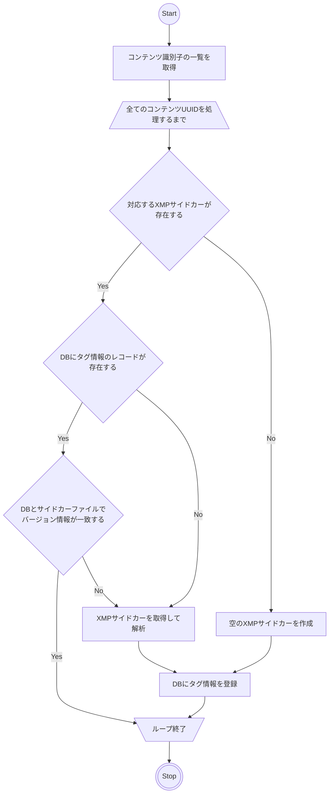

# ドキュメントのスコープ

本ドキュメントのスコープは以下とする

* コンテンツストレージからXMPサイドカーを取得してタグを抽出する方法の説明
* 抽出したタグによってメタデータ及び検索用インデックスを更新する方法の説明

正規コンテンツ及びXMPサイドカーへのアクセスには、[content_storage.md](./content_storage.md)で定義された境界を使用する。

# 処理フローの概要

# エラー処理
XMPサイドカーを取得できない場合、XMPとして解析できない場合又は新しいXMPサイドカーを作成できない場合は、当該コンテンツの更新処理を失敗とする。
この場合は既存のタグ情報を正常な最新情報として扱わず、当該コンテンツの更新失敗を記録して残りのコンテンツの処理を継続する。
